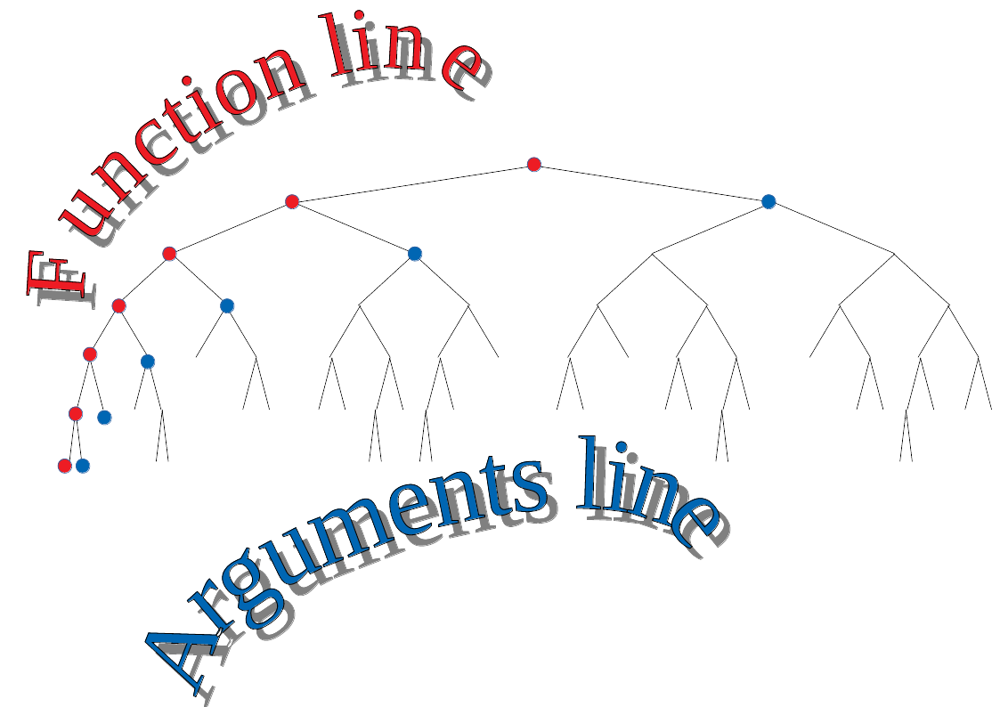

# A combinatory logic interpreter for further extensibility

A zpper-based implementation of a combinatory logic programming language with lazy evaluation and further extensibility

## Project goals and objectives

This project is intended to show some features of Haskell programming.
The software itself is a non-trivial, but still simple interpreter for a tiny but Turing-complete programming language.
This project is meant to be modified later to exemplify the usefulness of *monad tansformers*.
As for now, the project is in its purest stage, lacking yet any later feature extensions by monad transformers.
The  source contains no monad transformers yet.

### Tutorials on monad transformers

Haskell tutorials and articles about advanced funtional programming and design usually explain the concept and use of monad transformers exemplified by small *interpreter* programs:a small embedded language is presented — usually a language of a small pocket calculator software — whose capabilities are augmented gradually by logging (tracing), error reporting, variable usage, configurable user options etc.

The main idea is that all these additional features can be added rather seamlessly and in a modular way to the basic calculator functionality, which can be kept easily readable and simple. Monad transformers provide a way to keep the „core algorithm” and the „effectful extensions” apart, loosely coupled, untangled. Spoiler: this is not entirely true, monad transformers cannot fill in this vision without compromises.

### A project in its virgin stage, exemplifying the possible usefulness of monad transformers without actully using them

This project is inteded to provide a somewhat more complex base project than the familiar pocket calculator language of the tutorials. It is an interpreter, but not of a simple pocket calculator language. Instead, a Turing-complete algorithmic language is implemented. It is one of the simplest in this category: it is essentially an implementation of *combinatory logic*. Combinatory logic is a similar theoretical framework as lambda calculus. So, the core part of the project is a „leftmost outermost” traversal of a binary tree while matching certain rule patterns: it implements comninatory logic along a call-by name (lazy evalulation) strategy, thus it provodes a tiny fuctional programming language belonging to the family of Miranda, Haskell, Clean.

Althought theoretically it is Turing complete, it is a simple mathematical calculus, lacking any systactic sugar, usar friendliness, and lacking also effects. If they will be implemented in future, most probably it can be done the best way with monad transformers.

In short: this project does not contain monad transformers yet. It provides a starting point, an apropos on which the use of monad transformers can be exemplified later in future.
In its current stage, it can *reduce* (evaluate) *terms* (expressions) of combinatory logic terms. The reductions steps of these terms can be regarded as the operation of a pure lazy functional programming language. Despite of being minimalistic, it presents all practical problems which can exemplyfy the usefulness of architectural design patterns.

The main advantage of the vision of the whole project: combinatory logic provides a well balanced trade-off between two antagonistic desirable didactic properties, described below.
 * it is simple enough to exemplify a pure interpreter: mathematically it is a very pure and a well-described theory is underlying it.
 * still, it is complicated enough to provide need and meaning to advanced features implemantable via monad transformers: it can provide good apropos for non-trivial use cases of the most important monad transformer examples.

Features to be added in future:
 * error reporting,
 * tracing information
 * User options configurable (e.g. execution runaway check limit, evaluation strategy, the set of base combinators etc.)
 * an execution-step counting to limit runaway (infinitely running) „programs” (combinatory logic term evaluation processes).

### The RWS monad transformer(s)

`RWS` is a compound stack of monad transfomers consisting of effect functionalities of a `Reader`, a `Writer`, and a `State` monad.
In this project\'s context, use the `State` monad for executon step counting (safety check against infinite runaway), use `Reader` for user configurability (optioning evaluation stategy as lazy vs strict, toggling step counting on and off, selection the set of base combinators). `Writer` monad is useful for tracing.

## Related projects

### Alternative approaches than monad transformers?

Monad transformers are sometimes regarded as theoretically suspicious and ugly, still, the question of a „purer” alternative remains open.
The Utrecht University\'s UUAGC is an interesting approach to provide surprizing modularity, a maybe stronger „glue” than that of monads and monad transformers.
In any case, learning deep underlying theories like category theory or Martin-Löf type theory (dependent types) seems to provide wide horizons and prospects for future.

As for a few words about connections to Agda: representing Vector and Matrix manipulations with dependent types. Using propositions-as-types for proving small algebraic theorems on minimalistic programs, like proving the commutativity of addition among natural numbers.

Category: here I am proving (in intuitionistic logic and in Gentzen-style natural deduction) that in the category of **Set**s epimorphism coincide with surjective functions.

### Transferring functional programming techniques to conventional languages

Although it looks very straightforward that we should use Haskell to implement a combinatory logic interpreter of normal-order evaluation strategy — „big brother” effect — but that is not an absolute necessity. The main algorithm demonstrated in this project is based on zippers, an algebraic datatype, and there is nothing that can revent us to implement algebraic datatypes in conventional languages like PHP or JavaScript.

So, a secondary, silent objective of this project is to present techniques of „conventional”, „imperative” programming languages to implement core Haskell techniques. Any familiary algebraic data type can be implemented in languages like PHP or JavaScript via a technique called „case objects” (originally made popular in the Scala community). Furthermore, Haskell typeclasses — among them the most often used monads — can be implemented by PHP or JavaScript *trait* constructs over these case objects. Samples for all these can be found in the [doc](doc) folder of this project: [doc/PHP](doc/PHP) and [doc/JavaScript](doc/PHP).

By using these, the entire project could be reimplemented in PHP or JavaScript by using the same ideas. Of course, we can easily bypass uding a zipper in an imperative language by using mutable data structures.

Another exmple for using Haskell techniques in JavasCript is a collision detection program based on solving linear inequality systemms by Fourier-Motzkin elimination. [Haskell code] and [JavaScript code]

In summary: Haskell projects sometimes can be implemented in conventional languages in a straightforward, although not trivial way. This means also a way to provide a web application user interface to a Haskell project. Of course, Haskell itself has its own ecosystem in web programming too: for example, Scotty among the simplest ones. Two very simple Scotty projects of mine implement smple mathematical games and problems: [Stones on a beach] and [Gold or goat].

## About combinatory logic as a programming laguage

Combinatory logic terms are implemented as binary trees, where the leaves can have their values from among the base combinators (usually from simply two symbols, **S** and **K**). These trees are regarded as the *terms* of combinatory logic. Programming in pure combinatory logics (CL) means *evaluating* such CL-terms. Evaluation of a CL-term is executing reduction steps on such a tree, i.e. matching certain rules on it, and replacing a subtree with another subtree according to the rules. One of the reduction rules means that any subtree of the form **(K** *x* **)** *y* is replaced to *x* (here, *x* and *y* are meant as metavariables, thus representing any subtree). Another reduction rule is replacing any subtree of the form **((S** *u* **)** *f* **)** *x* to subtree **(** *u* *x* **)** **(** *f* *x* **)**. These two rules are enough, they already enable a Turing-complete programming laguage.

In almost all cases (except for the most simple ones) there are several (more than one) ways in which order and strategy the reduction rules can be applied on a tree. Although the use of these rules determine term evaluation in a consistent way in normal cases (i.e. the order of the rule does not matter, the result will be the same), there are some „runaway” cases, with reduction steps going in an infinite circle. As in any Turing-complete language, such runaway cases cannot be excluded entirely. The order in which reduction rules are applied *does* matter in some of such runaway cases: there can be a reduction rder strategy leading to runaway case, at the same time another evaluation order can lead to regular termination. There is a specal reduction strategy that ensures termination in as many cases as possible. This strategy has advantages both theoretically and practically, this is called the *normal reduction strategy*. This corresponds to exactly what the functional programmers call the *lazy evaluation*.

Lazy evaluation makes design patterns and architerctures possible not easily awailable in strict evaluating languages. In the case of my little combinatory logic inerpeter, lazy evaluation makes possible defining a recursion pattern without adding any special rule to the language — the two reduction rules described above are enough. This conceptual economy and minimalism can be achieved by the **Y** combinator: the essence is that any subtree of the form **(Y** *f* **)** reduces to *f* **( Y** *f* **)**. Although this seem like a runaway case leading to infinite circles in the reduction path, lazy evaluation means that the *f* function has always a control and can stop reduction leading to termination. Because the **Y** combinator can be defined upon the base combinators **S** and **K**, all that means that in case of lazy evaluation strategy we do not need any special construct to define recursion: it is entirely enough to have the two base combinators combinators **S** and **K**, and the two reduction rules **(K** *x* **)** *y* → *x* and **((S** *u* **)** *f* **)** *x* to subtree **(** *u* *x* **)** **(** *f* *x* **)**.

## Implementation

The easy parts are: implementing a binary tree, with leaves having values from a set of two symbols. the solution is standard and straitforward.
Reduction rules are simply matching subtrees to the left-hand-sides of the reduction patterns, and in matching case, replacing the matching subtree with the right-hand-side of the triggered pattern.

An important concept: a *regexp*. A regexp is a meatching subtree (subterm), that means a subtree that matches a rule, and we have not prerformed the rule (the replacement) yet on it. In other words: a regexp is a subtree (subterm) matching the left-hand-side of a reduction rule.

The hard part: lazy evaluation. That means that a normal order reduction strategy must be implemented. We kow already that this means that we must always try to match the leftmost outermost regex. No other regexps must be taken into account earlier than that. That means, that the tree must be traversed in a specific traversal.

If we want to traverse a tree in a custom way, we need a tree data structure with a moveable focus, a tree with a freely focusable node (analogously to have directory structure with a focusable working directiory that can be moved upper or moved deeper by selection). Such a tree with a freely cd-able focus node is called a *zipper*. Zippers are well known in literature, see [Wikipedia](https://en.wikipedia.org/wiki/Zipper_(data_structure)), also in [WikiBooks](https://en.wikibooks.org/wiki/Haskell/Zippers) or specific Haskell articles, originally described by Gérard Huet in 1997 ([Functional pearls: the zipper](https://www.st.cs.uni-saarland.de/edu/seminare/2005/advanced-fp/docs/huet-zipper.pdf)).

Implementing a zipper is still easy, as it hase a clean and standard literature. But the hard work is waiting yet for us. We have a combinatory logic term, i.e. a binary tree. We turni it into a zipper, let its focus be the root node. What should be our traversal strategy to find the leftmost outermost regexp first? If we could find an algorithm for that, we will have achieved our goal: implement the normal reducton order. i.e. the lazy evaluation. And then we have our nice combinatory logic interpreter ready implementing as a nice minimalistic functional programming language, capable of easy and clean design patterns, and having at the same time a recursion contruct for free.

My answer to this question is: let us algorithmize the following traversal:
 - Start with the focus in the root node
 - Check whether  it matches any of the (two) reduction rules. (i.e. check whether it is a regex). If it is a regex then trigger the matching reduction rule and we are ready with the frst reduction step.
 - But if that was not a redex, then go down the left branch (if any), and repeat from start.
 - But if that was not a redex, then go down the left branch (if any), and check again.
 - Do all these steps until You find a regex, or if You do not find any regex along this path, then do it until You go down the left branches of the tree reacing the leftmost leaf of the tree. The figure shows this leftmost traversal path with the red spots. I say: the nodes marked with the red spots constitute together what I call the „*function path*” / „*function line*” of the tree. In summary: You have gone down the „function line” of the tree while searching for a regexp. You are now at the bottom of the function line of the tree (see figure).
 - Now jump from the bottom of the function line to the bottom of the „*arguments line*” of the tree! You can see on the figure what the „*arguments line*” of the tree is. The „arguments line” is constituted by the nodes marked with ble spots on the figure.
 - Go upward along the „arguments line”, until you match a regexp, or until You reach the topmost node of the arguments line (i. e. the right child of the root node)! During Your path upward along the arguments line, at each node of the arguments line make a recursive call of the whole reduction strategy described here!

In summary: traverse the tree with a zipper with its focus starting from the root node, gowing down the function line, from the bottom of function line the jump to the bottom of the arguments line, and go up along the arguments line! During Your path downward on the function line, simple check at each node of the line whether the current node is a regexp! During Your upward path along the arguments line, at each node make a complete recursive call (with current node regarded as the root of a subtree under it), it is not enogh to check the current node!

This algorithm warrants that You will always find the leftmost outermost regexp firstm so You will have all benefits of lazy evaluation, and You will have Your implemented combinatory logic lagnuage not only Turing complete, but also programmable in nice patterns and You get also an automatically emergent recursive construct.
