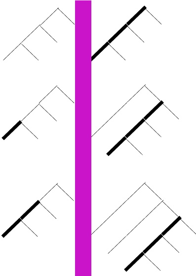

# A combinatory logic interpreter for further extensibility

A zpper-based implementation of a combinatory logic programming language with lazy evaluation and further extensibility

## Project goals and objectives

This project is intended to show some features of Haskell programming.
The software itself is a non-trivial, but still simple interpreter for a tiny but Turing-complete programming language.
This project is meant to be modified later to exemplify the usefulness of *monad tansformers*.
As for now, the project is in its purest stage, lacking yet any later feature extensions by monad transformers.
The  source contains no monad transformers yet.

### Tutorials on monad transformers

Haskell tutorials and articles about advanced funtional programming and design usually explain the concept and use of monad transformers exemplified by small *interpreter* programs:a small embedded language is presented — usually a language of a small pocket calculator software — whose capabilities are augmented gradually by logging (tracing), error reporting, variable usage, confogurable user options etc.

The main idea is that all these additional features can be added rather seamlessly and in a modular way to the basic calculator functionality, which can be kept easily readable and simple. Monad transformers provide a way to keep the „core algorithm” and the „effectful extensions” apart, loosely coupled, untangled. Spoiler: this is not entirely true, monad transformers cannot fill in this vision without compromoses.

### A project in its virgin stage, exemplifying the possible usefulness of monad transformers without actully using them

This project is inteded to provide a somewhat more complex base project than the familiar pocket calculator language of the tutorials. It is an interpreter, but not of a simple pocket calculator language. Instead, a Turing-complete algorithmic language is implemented. It is one of the simples in this category: it is essentially an implementation of *combinatory logic*. Combinatory logic is a similar theoretical framework as lambda calculus. So, the core part of the project is a „leftmost deepest” traversal of a binary tree while matching certain rule patterns: it implements comninatory logic along a call-by name (lazy evalulation) strategy, thus it provodes a tiny fuctional programming language belonging to the family of Miranda, Haskell, Clean.

Althought theoretically it is Turing complete, it is a simpla mathematical calculus, lacking any systactic sugar, usar friendliness, and lacking also effects. If they will be implemented in future, most probably it can be done the best way with monad transformers.

In short: this project does not contain monad transformers yet. It provides a starting point, an apropos on which the use of monad transformers can be exemplified later in future.
In its current stage, it can *reduce* (evaluate) *terms* (expressions) of combinatory logic terms. The reductions steps of these terms can be regarded as the operation of a pure lazy functional programming language. Despite of being minimalistic, it presents all practical problems which can exemplyfy the usefulness of architectural design patterns.

The main advantage of the vision of the whole project: combinatory logic provides a very well balanced trade-off:
 * it is simple enough to exemplify a pure interpreter: mathematically it is a very pure and a well-described theory is underlying it.
 * still, it is complicated enough to provide need and meaning to advanced features implemantable via monad transformers: it can provide good apropos for non-trivial use cases of the most important monad transformer examples.

Features to be added in future:
 * error reporting,
 * tracing information
 * User options configurable (e.g. execution runaway check limit, evaluation strategy, the set of base combinators etc.)
 * an execution-step counting to limit runaway (infinitely running) „programs” (combinatory logic term evaluation processes).

### The RWS monad transformer(s)

RWS is a compound stack of monad transfomers consisting of effect functionalities of a Reader, a Writer, and a State monad.
In this project\'s context, use the `State` monad for executon step counting (safety check against infinite runaway), use Reader for user configurability (optioning evaluation stategy as lazy vs strict, toggling step counting on and off, selection the set of base combinators). Writer monad is useful for tracing. 

### Alternative approaches than monad transformers?

Monad transformers are sometimes regarded as theoretically suspicious and ugly, still, the question of a „purer” alternative remains open.
The Utrecht University\'s UUAGC is an interesting approach to provide surprizing modularity, a maybe stronger „glue” than that of monads and monad transformers.
In any case, learning deep underlying theories like category theory or Martin-Löf type theory (dependent types) seems to provide wide horizons and prospects for future.

As for a few words about connections to Agda: representing Vector and Matrix manipulations with dependent types. Using propositions-as-types for proving small algebraic theorems on minimlistic programs, like proving the commutativity of addition among natural numbers.

Category: here I am proving (in intuitionistic logic and in Gentzen-style natural deduction) that in the category of **Set**s epimorphism coincide with surjective functions.

### Transferring functional programming thechniques to conventional languages

Another objective is to present techniques of „conventional”, „imperative” programming languages to implement core Haskell techniques. Any familiary algebraic data type can be implemented in languages like PHP or JavaScript via a technique called „case objects” (originally made popular in the Scala community). Furthermore, Haskell typeclasses — among them the most often used monads — can be implemented by PHP or JavaScript *trait* constructs over these case objects. Samples for all these can be found in the `doc` map of this project.

By using these, the entire project could be reimplemente in HP or JavaScript, and so the project can be given a web application user interface. Of course, Haskell itself provides its own ecosystem: for example, Scotty among the simplest ones.

## Implementation

Combinatory logic terms are implemented as binary trees. reductions steps need a management of current focusing on subexpressions to match a rule patters. Thus, the interperter implementation is based on *binary trees with moveable focus*: data strucuture called *zippers*.

